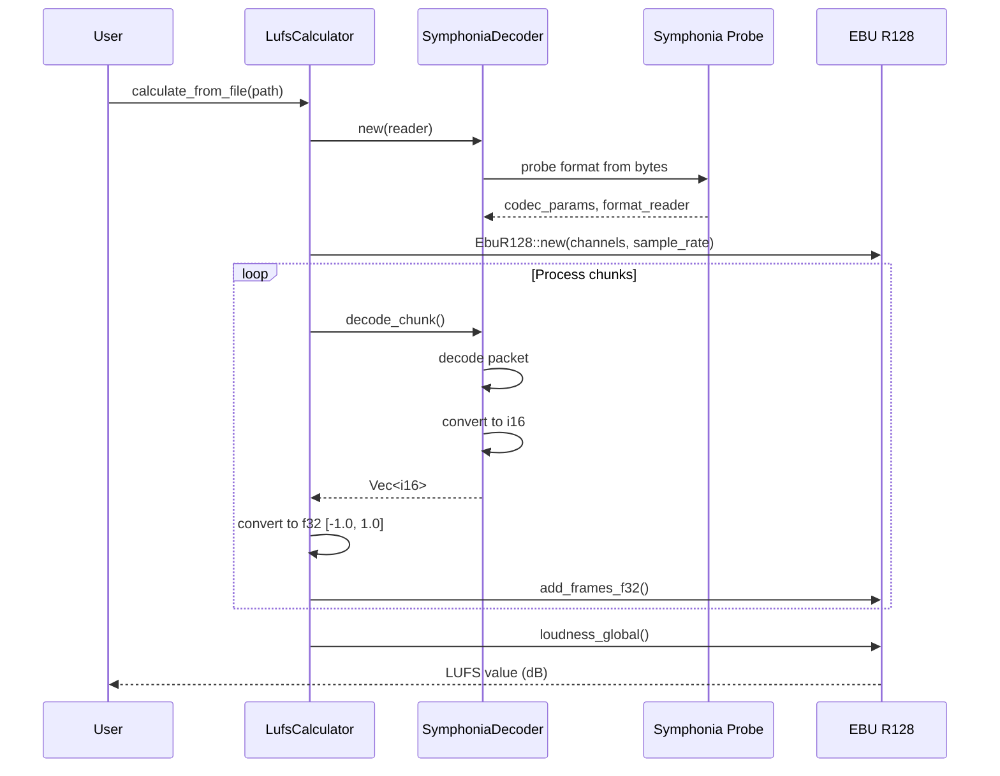

# CLAUDE.md

This file provides guidance to Claude Code (claude.ai/code) when working with code in this repository.

## Project Overview

LUFS Generator (lufsgen-android) is a pure Rust library and binary for calculating LUFS (Loudness Units Full Scale) of audio files. It uses streaming decoders to process audio chunk-by-chunk without loading entire files into memory, making it suitable for mobile devices like Android.

## Key Features

- **Streaming audio decoders** supporting MP3, OGG, WAV, FLAC, AAC, M4A, and MP4
- **Automatic format detection** from stream content (magic bytes) - no file extension required
- **Memory-efficient** chunk-based processing (8192 samples per chunk)
- **EBU R128 compliant** loudness measurement using ebur128 crate
- **Cross-platform** - works on Linux, macOS, and Android (via Termux or custom build)

## Architecture

### Project Structure

```
fa/
├── Cargo.toml           # Project dependencies and workspace config
├── src/
│   ├── lib.rs           # Library entry point, public API exports
│   ├── main.rs          # Binary entry point (CLI tool)
│   ├── decoders.rs      # AudioDecoder trait and format-agnostic create_decoder()
│   ├── decoders/
│   │   └── symphonia_decoder.rs  # Unified Symphonia decoder implementation
│   ├── lufs.rs          # LufsCalculator, progress reporting
│   └── error.rs         # Error types (LufsError, Result)
└── target/              # Build output (not in git)
```

### Key Modules

#### `src/lib.rs` - Library Entry Point
- Public API re-exports
- `SUPPORTED_EXTENSIONS` constant: `["wav", "mp3", "ogg", "oga", "flac", "aac", "m4a", "mp4"]`
- `is_audio_file()` helper for extension checking

#### `src/decoders.rs` - Decoder Factory
- `AudioDecoder` trait with `sample_rate()`, `channels()`, `decode_chunk()` methods
- `create_decoder(reader)` - Auto-detects format from stream content
- `create_decoder_from_path(path)` - Convenience function for files

#### `src/decoders/symphonia_decoder.rs` - Unified Decoder
- Implements `AudioDecoder` trait using Symphonia
- Detects format from magic bytes, not file extension
- Handles all sample formats: f32, f64, i8, i16, i24, i32, u8, u16, u24, u32
- Converts all samples to i16 PCM for EBU R128 processing

#### `src/lufs.rs` - LUFS Calculator
- `LufsCalculator` with configurable chunk size
- `calculate_from_file(path)` - Process audio file
- `calculate_from_file_with_progress(path, progress)` - With AtomicU64 progress callback
- `calculate_from_reader(reader)` - Process any Read type (auto-detects format)

## Decoding Flow



## Build Commands

### Development
```bash
cargo build              # Build for host architecture
cargo test               # Run tests
cargo run /path/to/music  # Run binary on music file/directory
```

### Android Cross-Compilation
```bash
export NDK_HOME=/home/afeather/.local/android/ndk/23.2.8568313
export CC_aarch64_linux_android=${NDK_HOME}/toolchains/llvm/prebuilt/linux-x86_64/bin/aarch64-linux-android29-clang
export CARGO_TARGET_AARCH64_LINUX_ANDROID_LINKER=${NDK_HOME}/toolchains/llvm/prebuilt/linux-x86_64/bin/aarch64-linux-android29-clang
cargo build --release --target aarch64-linux-android
```

Deploy to Android:
```bash
scp -P 8022 target/aarch64-linux-android/release/lufsgen 192.168.136.29:~/
ssh -p 8022 192.168.136.29 "~/lufsgen /path/to/music.mp3"
```

## Dependencies

### Core Dependencies
- **symphonia** 0.5 - Unified multimedia framework for audio decoding
  - Features: mp3, ogg, flac, aac, isomp4, wav
- **ebur128** 0.1 - EBU R128 loudness measurement
- **indicatif** 0.17 - Progress bar (binary only)

### Why Symphonia?

1. **Format detection from stream** - Works even when users only have a stream, no file path/extension
2. **Single API** - `create_decoder(reader)` works for all formats
3. **Comprehensive** - Supports all major audio formats
4. **Pure Rust** - No C dependencies, easier cross-compilation

## Supported Audio Formats

| Extension | Format | Status | Notes |
|-----------|--------|--------|-------|
| mp3 | MP3 | ✅ | Most common |
| ogg, oga | OGG/Vorbis | ✅ | oga is audio-only ogg |
| wav | WAV | ✅ | 16-bit PCM |
| flac | FLAC | ✅ | Lossless |
| aac | AAC | ✅ | ADTS format |
| m4a, mp4 | M4A/MP4 | ⚠️ | MP4 container with AAC audio (may fail on DRM-protected files or files with metadata at end) |

### M4A/MP4 Format Notes

Some M4A files may fail with "Failed to detect audio format" error. This happens when the MP4 container's `moov` atom (metadata) is placed at the end of the file instead of the beginning. Symphonia's format probe requires metadata at the start.

**Solution**: Convert the file with FFmpeg using the `+faststart` flag to move metadata to the beginning:
```bash
ffmpeg -i input.m4a -c:a copy -movflags +faststart output.m4a
```

The `-c:a copy` flag copies the audio stream without re-encoding (fast, no quality loss), while `-movflags +faststart` optimizes the file for streaming by moving the `moov` atom to the front.

## Error Handling

All operations return `Result<T>` where errors are:
- `LufsError::Io` - File I/O errors
- `LufsError::UnsupportedFormat` - Unknown format
- `LufsError::DecodeError` - Audio decoding errors
- `LufsError::EbuR128Error` - EBU R128 calculation errors
- `LufsError::InvalidData` - Corrupt or invalid audio data

## Testing

Unit tests cover:
- Decoder creation (valid/invalid readers)
- Format detection from extensions
- Calculator initialization
- File existence checks
- Error handling

To test with real audio files on Android:
```bash
# Single file
~/lufsgen /path/to/song.mp3

# Directory scan
~/lufsgen /sdcard/Music/

# Save results
~/lufsgen /sdcard/Music/ output.txt
```

## Code Standards

1. **Streaming-first** - Never load entire files into memory
2. **Auto-detection** - Format detection from content, not extension
3. **Error messages** - Include context and suggestions
4. **Tests** - Unit tests for all public APIs
5. **Documentation** - Public items have rustdoc comments

## Git Commit Message Format

```
Brief summary of changes (50 chars or less)

Detailed explanation of what was changed and why.
- Specific change 1
- Specific change 2

Co-Authored-By: Claude Opus 4.6 <noreply@anthropic.com>
```

## Future Improvements

- [ ] Add Opus codec support (via symphonia-codec-opus)
- [ ] Support for reading metadata (artist, album, title)
- [ ] ReplayGain calculation (uses same EBU R128)
- [ ] Parallel processing of multiple files
- [ ] Output JSON format for integration
